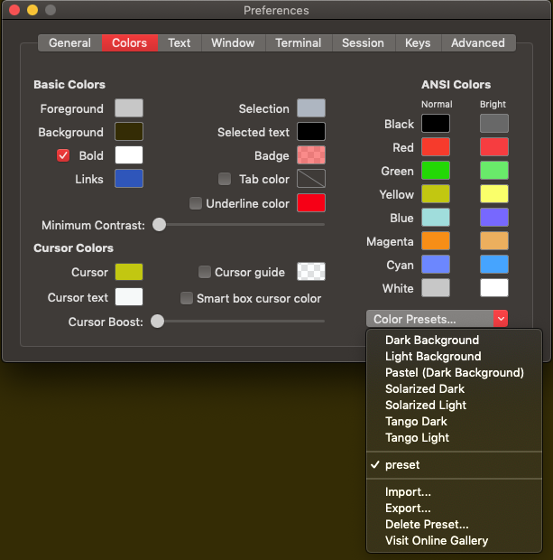

# MacOS setup

What you need to know to reinstall MacOS machine from scratch

> **Disclaimer:** Everyone is - and I hope always - free to configure and use tools they like the most. Here's the one I decide to use.

## General knowledge

* use _filevault_ to encrypt data
* update MacOS regularly
* update your soft and tools regularly too
* install Xcode (`xcode-select --install`)
* install your preferate nav, I use [Chrome](https://www.google.com/chrome/browser/desktop/index.html)   ¯`\`_(ツ)_/¯
* install [iTerm2](https://iterm2.com/) to replace standard _Terminal_
* install [GPG Keychain](https://gpgtools.org/keychain/index.html) to encrypt/decrypt emails
* install [Slack](https://slack.com/intl/fr-fr/downloads/osx) cause, you know, you have to communicate sometimes
* install [Airmail](https://airmailapp.com/), it's not free but really effective
* install [Alfred](https://www.alfredapp.com/), not free either but it's a damn good product which replace poor spotlight
* install [ImageOptim](https://imageoptim.com/mac) to compress effectively your pictures

## Other tools

### Brew

**What is HomeBrew?**

HomeBrew is an opensource freeware packet manager for OSX. It's kind of `apt-get` but for Mac 🍺

You'll find everything about it here: https://brew.sh

NB: Cask is an extension for graphical apps

**How to install brew?**

Install it with `curl` from your favorite _terminal_:

```bash
/usr/bin/ruby -e "$(curl -fsSL https://raw.githubusercontent.com/Homebrew/install/master/install)"
```

**Some usefull commands**

- Check brew state:

```bash
brew doctor
```

- Upgrade brew

```bash
brew upgrade
```

- Update brew

```bash
brew update
```

- Install something

```bash
brew install my_fraking_tool
```

### Terminal

I try some terminals but `iTerm2` is definitively my favorite.
It sends old terminal back to middle age, and continue to provide improvements

**Installation**

You have to install it manually from [official website](https://www.iterm2.com/)

[Download `preset.itermcolors` file](config/preset.itermcolors)

To add custom _colors preset_ on iterm, use `⌘` + `i` to open _preferences_, go on _Colors_ tab and _import_ custom `preset.itermcolors` file. To use it permanently, go back to _General_ tab and click on `Copy Current Settings to Selected Profile` button



#### ZSH

ZSH is a command prompt from [_Bourne Shell_](http://www.grymoire.com/Unix/Sh.html) family.

**Installation**

ZSH is already integrated on MacOS, but the default shell is _bash_. You can activate it with this command:

```bash
chsh -s /bin/zsh
```

But it's most convinient to reinstall last version using `brew`:

```bash
brew update
brew install zsh zsh-completions
```

Then, we need to activate autocompletion with _fpath_:

```bash
echo 'fpath=(/usr/local/share/zsh-completions $fpath)' >> ~/.zshrc
```

Finally, configure the path and activate _zsh_:

```bash
sudo echo /usr/local/bin/zsh >> /etc/shells
chsh -s `which zsh`
```

You can activate wizard manually:

```bash
autoload -U zsh-newuser-install
zsh-newuser-install -f
```

Configuration file:

- [_zshrc_ file](config/zshrc.md)

##### OhMyZsh

`Oh-My-Zsh` (OMZ) is an opensource awesome tooling for _ZSH_. See everything you need to know in [official website](http://ohmyz.sh/)

**Installation**

```bash
sh -c "$(curl -fsSL https://raw.github.com/robbyrussell/oh-my-zsh/master/tools/install.sh)"
```

**Customisation**

Here's two cool links to custom your own _terminal_:

- https://www.synbioz.com/blog/astuces_zsh_installer_et_comprendre_oh_my_zsh
- https://www.synbioz.com/blog/astuces_zsh_plugins_git_oh_my_zsh

[My personal theme](config/custom.zsh-theme.md)

### GnuPG

GnuPG is a complete and free implementation of the OpenPGP standard. it allows you to encrypt and sign your data and communications, mainly over email.

See according section [here](gpg_keychain.md)

### Ruby

There are two main version `Ruby` manager on MacOS, `Rbenv` and `RVM`.

I personaly prefer to use `rbenv`, [here's why](https://blog.metova.com/choosing-a-ruby-version-management-tool)

[Another link about it in french](https://www.synbioz.com/blog/rbenv_pour_les_developpeur)

[Some usefull commands](https://github.com/rbenv/rbenv#command-reference)

#### Take note!

Rbenv requires to export specific path to activate it and proceed to _eval_ whenever you start new shell session, here's how:

```bash
# ~/.zshrc

export PATH="$HOME/.rbenv/bin:$PATH"
eval "$(rbenv init -)"
```

### Git

Git is an Open Source Distributed Version Control System

**Installation**

There are many ways to install `Git`, here the simple one:

```bash
brew install git
```

Configuration files:

- [_gitconfig_ file](config/gitconfig.md)
- [_gitignore_global_ file](config/gitignore_global.md)

Change language to english using this command:

```bash
echo "export LANGUAGE='en_US.UTF-8 git'" >> ~/.zshrc
```

#### Git Flow

[Git Flow](https://danielkummer.github.io/git-flow-cheatsheet/index.html) are a set of git extensions to provide high-level repository operations for Vincent Driessen's branching model.

**Installation**

Install it with `brew`, but take note there are two packages for git-flow included a deprecated one. You can use _search_ command:

```bash
brew search git-flow

==>       git-flow     git-flow-avh
```

Please consider to use the maintened one:

```bash
brew install git-flow-avh
```

#### Usage

You can use this [_cheatsheet_](https://danielkummer.github.io/git-flow-cheatsheet/)

Some usefull [_alias_](https://github.com/akarzim/zsh-git-flow-aliases)

### A good IDE

Usually, I used to use ATOM, which was good enough over the past 3 years. But since, I discovered [VSCode](https://code.visualstudio.com/) which is really good (it's a fork of ATOM after all).

VScode provide a quick setup, using `Crtl` + `Maj` + `P` and search for _code_. But there is an issue about the fact this command is reset after OS reboot (see here: https://github.com/Microsoft/vscode/issues/48124)

To resolve this issue, just add the path manually on `~/.zshrc` or `~/.bash_profile` file:

```bash
# export vscode path manually since there is a bug with it
export PATH=$PATH:/Applications/Visual\ Studio\ Code.app/Contents/Resources/app/bin
```

#### Specific configuration

Add an option to create an new empty line at the end on a file when saving,
and to add specific _tabSize_ settings:

`⇧ MAJ` + `⌘ command` + `p` to open the _command palette_, then type `Preferences: Open Settings (JSON)` and add this line to the JSON file:

```json
{
    ...,
    "files.insertFinalNewline": true,
    "editor.tabSize": 2
}
```

#### Plugins

VSCode use plugins to implement extra functionalities, such as autocompletion, UI-UX improvment, prefered programming language features, etc.

Here's the best I use:

- Docker
- file-icons
- Ruby
- Ruby Markers
- Ruby on Rails
- shellman
